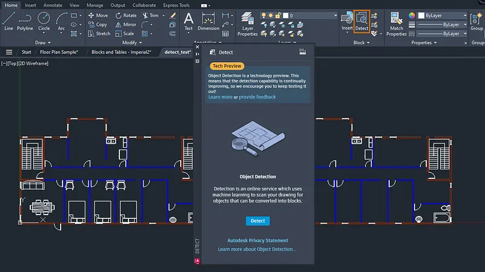

# 🚀 **crack autocad 2020** | **autodesk crack**

Imagine transforming your workflow with a tool built for unmatched **reliability** and cutting-edge **software quality**. **crack autocad 2020** delivers exactly that, empowering you with robust features designed to streamline processes and enhance productivity. With **autodesk crack**, experience seamless integration and trust in a solution crafted to meet the highest standards.

## 🚀 Features of **crack autocad 2019**

- 💪 **Advanced Functionality and Tools**:  
  **crack autocad 2019** offers cutting-edge tools designed to enhance productivity. With its robust set of features, users can tackle complex tasks with ease, ensuring efficiency and precision.

- 🎨 **User-Friendly Interface**:  
  The intuitive design of **crack autocad 2019** ensures that even beginners can navigate effortlessly. Its sleek layout prioritizes simplicity without compromising on the powerful capabilities of the software.

- 🏆 **Professional-Grade Features**:  
  Equipped with top-tier functionalities, **crack autocad 2019** is tailored for professionals who demand high performance. These **civil 3d crack**-driven features empower users to achieve superior results in their projects.

- 🔄 **Regular Updates and Support**:  
  Staying ahead of industry trends, **crack autocad 2019** provides consistent updates to ensure reliability and security. Our dedicated support team is always available to assist users with any queries or issues they encounter.

- 🔗 **Integration Capabilities**:  
  Seamlessly integrate **crack autocad 2019** with other platforms and systems using its versatile APIs. This compatibility enhances workflow flexibility, allowing businesses to scale efficiently.

---

## 🛡️ Trust and Reliability with **autocad 2021 crack**

When it comes to **trust** and **reliability**, **autocad 2021 crack** stands out as a leader in the tech space. We understand the importance of keeping your data secure and ensuring a smooth, safe experience every time you interact with our platform. Here's how we prioritize security and reliability:

### Software Security Measures
Our software is built with cutting-edge **security measures** that protect against potential threats. From advanced encryption protocols to multi-layered firewalls, we ensure that your data remains safe at all times.

### Data Protection and Privacy
Your **data protection** and **privacy** are non-negotiable for us. We adhere to strict compliance standards and employ robust mechanisms to safeguard sensitive information. You can trust that your data will always be handled with care and transparency.

### Regular Security Updates
Staying ahead of emerging threats is crucial. That’s why we provide **regular security updates** to patch vulnerabilities and enhance performance. With **autocad 2021 crack**, you’re always protected with the latest advancements in cybersecurity.

### Safe Download Process (**autocad civil 3d crack**)
We know how important it is to have a seamless and secure download process. With **autocad civil 3d crack**, you can rest assured that every download is verified and free from malicious content. Our system ensures that only legitimate files reach your device.

### Proven Track Record
Backed by years of experience and a **proven track record**, **autocad 2021 crack** has earned the trust of thousands of users worldwide. Our commitment to excellence and customer satisfaction speaks volumes about our dedication to providing top-notch solutions.

---

### Why Choose **autocad 2021 crack**?
Because when it comes to security and reliability, we don’t just meet expectations—we exceed them! Ready to experience peace of mind? Get started today.

## Getting Started with **autocad crack version**

Welcome to the world of **autocad crack version**! This guide will walk you through the essential steps to get started, ensuring a smooth and efficient setup process. Follow the steps below to begin your journey.

1. 📥 **Download and Installation**
   - Visit the official **autocad crack version** website or repository to download the latest version.
   - Run the installer and follow the on-screen instructions for installation.
   - Ensure that all prerequisites, such as **auto cad 2018 crack**, are installed on your system.

2. 🔧 **Initial Setup**
   - Once installed, launch the application from your desktop or terminal.
   - Create a new project or profile to start configuring your environment.
   - If prompted, select the default settings or customize them based on your preferences.

3. 🛠️ **Basic Configuration**
   - Navigate to the settings menu and configure the basic options for **autocad crack version**.
   - Enable the necessary features by toggling the appropriate switches.
   - Integrate **auto cad 2018 crack** if required for advanced functionality.

4. 🚀 **First Use Guide**
   - Open the main dashboard and explore the interface to familiarize yourself with the layout.
   - Perform a test run to ensure everything is set up correctly.
   - Refer to the documentation for additional tips and tricks to enhance your experience.

Ready to dive in? Get started now and unlock the full potential of **autocad crack version**!

